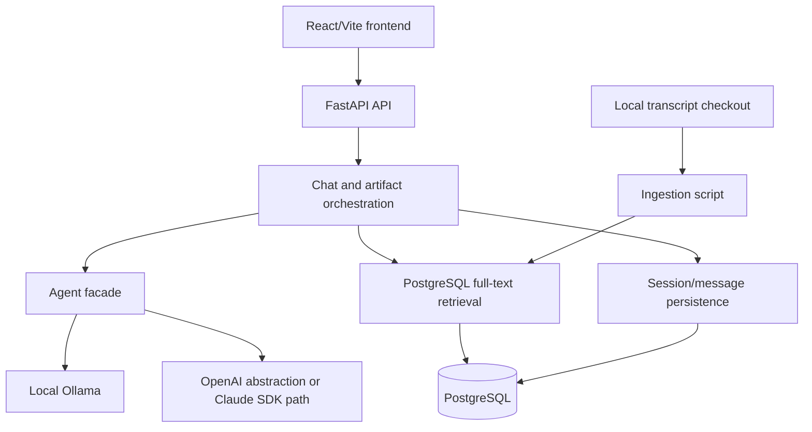

# Lenny Growth Assistant

Lenny Growth Assistant is an AI product and growth assistant grounded in Lenny's Podcast transcripts. It supports conversational follow-ups, deterministic transcript source attribution, and Markdown or sandboxed HTML artifact generation.

## What it does

- Answers product, growth, startup, and leadership questions using retrieved transcript excerpts.
- Keeps follow-up questions within a PostgreSQL-backed session.
- Maps model `SOURCE N` references to authoritative retrieved transcript metadata.
- Generates grounded Markdown artifacts.
- Generates complete HTML artifacts for preview in a sandboxed iframe.
- Provides a Ship 30 for 30-style writing skill for matching requests.
- Uses local Ollama with `llama3.2:3b` as the current local demo path.
- Supports optional OpenAI configuration and a separate Claude Agent SDK path.

## Architecture

The React/Vite frontend calls the FastAPI API. The backend validates sessions, retrieves transcript chunks from PostgreSQL, runs the selected agent/provider path, validates citations, persists messages, and returns optional artifacts.



More detail:

- [PRD.md](PRD.md) covers product scope, decisions, risks, and metrics.
- [design.md](design.md) covers the current conversation and Artifact Viewer UX.
- [architecture.md](architecture.md) covers data flow, providers, ingestion, security, and reliability.

## Repository structure

```text
backend/
  app/
    api/          FastAPI routes
    core/         application logging
    db/           SQLAlchemy engine and database dependency
    models/       sessions, messages, transcripts, transcript chunks
    schemas/      request and response models
    services/     chat, retrieval, LLM, agent, citations, artifacts, skills
  alembic/        database migrations
  scripts/        local transcript ingestion
  .env.example    backend configuration examples
frontend/
  src/            React/Vite application, API client, styles
  package.json    frontend scripts and dependencies
lenny-transcripts-source/
  episodes/       local transcript checkout currently present in this workspace
  index/          source archive index
  scripts/        source archive utilities
tests/             Python unittest suite
PRD.md             product requirements
 design.md         UX and interaction design
architecture.md    technical architecture
README.md          project setup and usage
```

The transcript checkout is available in the current workspace, but ingestion also accepts a separately supplied local checkout. A fresh evaluator setup should provide the transcript source directory and run ingestion.

## Prerequisites

- Python 3.11 or a compatible Python 3 version supported by the backend environment.
- Node.js and npm for the Vite frontend. The current development machine uses Node 24.11.1 and npm 11.6.2.
- PostgreSQL with a database named `lenny_growth` or an equivalent `DATABASE_URL`.
- Ollama for the local demo path.
- Git.
- A local checkout of the transcript source repository.

Docker is optional for local development. Container files are included, but Docker execution has not been verified on the current development machine.

## Quick start

### Backend environment

From PowerShell at the repository root:

```powershell
cd backend
.\.venv\Scripts\Activate.ps1
```

Create `backend/.env` from the example configuration. At minimum, local Ollama requires:

```env
DATABASE_URL=postgresql+psycopg://postgres:<password>@localhost:5432/lenny_growth
LLM_PROVIDER=ollama
OLLAMA_BASE_URL=http://localhost:11434/v1
OLLAMA_MODEL=llama3.2:3b
AGENT_BACKEND=local
LLM_TIMEOUT_SECONDS=180
```

Apply the database migrations:

```powershell
alembic upgrade head
```

Start FastAPI from the `backend` directory:

```powershell
$env:PYTHONPATH="."
python -m uvicorn app.main:app --reload --port 8000
```

### Frontend

In a second PowerShell terminal:

```powershell
cd frontend
npm install
npm run dev
```

Vite uses port `5173` by default. If that port is occupied, Vite may select another available port such as `5174`. The frontend API client defaults to `http://127.0.0.1:8000/api/v1`, and can be overridden with `VITE_API_BASE_URL`.

## Docker / Compose

Docker Desktop with Docker Compose is required for the container workflow. Docker is not installed on the current development machine, so the Compose stack has not been built or started locally.

Create a root `.env` from the secret-free template and change the development password before sharing the environment:

```powershell
Copy-Item .env.example .env
```

Start the complete stack from the repository root:

```powershell
docker compose up --build
```

Compose starts four services:

- `postgres`: PostgreSQL 16 with the `postgres_data` named volume.
- `ollama`: the official Ollama image with the `ollama_data` named volume.
- `backend`: FastAPI on host port `8000`.
- `frontend`: Nginx serving the Vite build on host port `5173`.

The backend uses the Compose service name `postgres` in `DATABASE_URL`, not `localhost`. The frontend is built with a relative `/api/v1` base URL; Nginx proxies `/api/` to the `backend` service, so browser requests do not depend on a container-internal hostname.

PostgreSQL readiness is checked before the backend starts. The backend container runs `alembic upgrade head` before starting Uvicorn. PostgreSQL data and Ollama model storage persist in named volumes. The backend and frontend also have health checks, and Ollama uses `ollama list` as its readiness check.

### Ollama model behavior

The Compose setup defaults to `LLM_PROVIDER=ollama`, `OLLAMA_MODEL=llama3.2:3b`, and the internal base URL `http://ollama:11434/v1`. Model storage is persistent, but the model is not pulled automatically during every startup. After the stack is running, pull the model once:

```powershell
docker compose exec ollama ollama pull llama3.2:3b
```

The backend remains configured for Ollama and does not silently switch to OpenAI if Ollama or the model is unavailable.

### Transcript ingestion

Transcript files are not copied into either application image. After the stack is running, run ingestion as an explicit operation using a local checkout. The simplest reproducible option is to run the existing script from the backend virtual environment on the host with a database URL that points to the published PostgreSQL port. Ingestion is not part of backend startup and is never run automatically by Compose.

Host example:

```powershell
$env:PYTHONPATH="backend"
$env:DATABASE_URL="postgresql+psycopg://postgres:<password>@localhost:5432/lenny_growth"
python backend/scripts/ingest_transcripts.py --source-dir C:\path\to\lenny-transcripts-source
```

### URLs and shutdown

- Frontend: `http://localhost:5173/`
- Backend API: `http://localhost:8000/`
- Swagger UI: `http://localhost:8000/docs`
- Health check: `http://localhost:8000/health`

Stop the stack with:

```powershell
docker compose down
```

Add `-v` only when intentionally removing the PostgreSQL and Ollama named volumes.

### Compose troubleshooting

- If the backend is unhealthy, inspect `docker compose logs backend postgres` and confirm PostgreSQL becomes healthy first.
- If chat reports that the model is unavailable, run `docker compose exec ollama ollama list` and pull `llama3.2:3b`.
- If the frontend cannot reach the API, confirm the frontend container is using `/api/v1` and that the backend health check passes.
- If the database is empty, migrations run automatically but transcript ingestion remains a separate explicit step.

## Environment variables

| Variable | Purpose | Default/example | Required for local Ollama? |
| --- | --- | --- | --- |
| `DATABASE_URL` | SQLAlchemy/PostgreSQL connection string. | `postgresql+psycopg://postgres:<password>@localhost:5432/lenny_growth` | Yes |
| `POSTGRES_DB` | PostgreSQL database name used by Compose. | `lenny_growth` | Compose only |
| `POSTGRES_USER` | PostgreSQL user used by Compose. | `postgres` | Compose only |
| `POSTGRES_PASSWORD` | PostgreSQL password used by Compose. | `change-me` development default; change it locally | Compose only |
| `LLM_PROVIDER` | Selects the OpenAI-compatible model provider used by the LLM service. | `ollama` | Yes, set to `ollama` |
| `OLLAMA_BASE_URL` | Ollama OpenAI-compatible API base URL. | `http://localhost:11434/v1` | Yes, unless using the client default |
| `OLLAMA_MODEL` | Ollama model name. | `llama3.2:3b` | Yes, unless using the client default |
| `OPENAI_API_KEY` | OpenAI credential when `LLM_PROVIDER=openai`. | No value is stored in this repository. | No |
| `OPENAI_MODEL` | OpenAI model name. | `gpt-4o-mini` | No |
| `AGENT_BACKEND` | Selects the agent orchestration path. | `local` | Yes, for the local path |
| `LLM_TIMEOUT_SECONDS` | Model request timeout. The implementation uses a 180-second default and enforces a 30-second minimum. | `180` | No |
| `TRANSCRIPT_SOURCE_DIR` | Optional transcript checkout or `episodes` directory for ingestion. | `../lenny-transcripts-source` in the example | No, only ingestion |
| `VITE_API_BASE_URL` | Frontend API base URL. | `http://127.0.0.1:8000/api/v1` | No |
| `ANTHROPIC_API_KEY` | Claude Agent SDK authentication option. | No value is stored in this repository. | No |
| `CLAUDE_CODE_OAUTH_TOKEN` | Alternative Claude Agent SDK authentication option. | No value is stored in this repository. | No |

`LLM_PROVIDER` and `AGENT_BACKEND` are separate selections. There is no silent fallback between provider or agent paths.

## PostgreSQL setup

The current local setup expects a database named `lenny_growth`:

```text
postgresql+psycopg://postgres:<password>@localhost:5432/lenny_growth
```

The backend loads `DATABASE_URL` from `backend/.env` when commands run from the `backend` directory. SQLAlchemy uses the connection for the FastAPI request dependency and Alembic uses the same setting for migrations.

Run migrations with:

```powershell
cd backend
.\.venv\Scripts\Activate.ps1
alembic upgrade head
```

The migrations create these application tables:

- `sessions`
- `messages`
- `transcripts`
- `transcript_chunks`

The transcript chunk table has the expression GIN index `ix_transcript_chunks_content_fts` on `to_tsvector('english', content)`. Retrieval continues to use PostgreSQL English full-text search with `websearch_to_tsquery`, `ts_rank`, descending rank order, and a limit.

## Ollama setup

Ollama is required for the local demo path. The current model is `llama3.2:3b` and the OpenAI-compatible base URL is `http://localhost:11434/v1`.

Install Ollama for Windows, then in PowerShell:

```powershell
ollama serve
```

In another terminal, pull the configured model:

```powershell
ollama pull llama3.2:3b
ollama list
```

The backend should use:

```env
LLM_PROVIDER=ollama
OLLAMA_BASE_URL=http://localhost:11434/v1
OLLAMA_MODEL=llama3.2:3b
```

If the model or Ollama service is unavailable, the API returns a safe `503 Service Unavailable` response and logs the failure without exposing provider details.

## Transcript knowledge base

The knowledge base is loaded from a local checkout of the Lenny's Podcast transcript archive. Each episode is expected at:

```text
episodes/<episode-folder>/transcript.md
```

Each transcript contains YAML frontmatter such as guest, title, `youtube_url`, `publish_date`, description, and keywords, followed by Markdown transcript content.

Run ingestion from the repository root with:

```powershell
$env:PYTHONPATH="backend"
python backend/scripts/ingest_transcripts.py --source-dir <transcript-checkout>
```

The script also accepts `TRANSCRIPT_SOURCE_DIR`. It accepts either the checkout root or its `episodes` directory. Source paths stored in PostgreSQL are portable, for example:

```text
episode-folder/transcript.md
```

The current chunking behavior is 4,000-character chunks with 500-character overlap. Ingestion is idempotent: unchanged records are skipped, changed records update in place, and their chunks are refreshed without duplicate transcript rows. Legacy absolute source paths are recognized by their portable suffix and normalized during refresh. Malformed or incomplete files are reported and skipped while ingestion continues.

The current verified database contains 302 valid episodes and 7,461 chunks. A fresh evaluator database must run migrations and ingestion; those records are not assumed to exist in a new database.

## Running the application

Use four local services/terminals as needed:

1. **PostgreSQL:** start PostgreSQL and make sure the `lenny_growth` database exists.
2. **Ollama:** run `ollama serve` and confirm `llama3.2:3b` is available with `ollama list`.
3. **FastAPI:** from `backend`, activate the virtual environment and run:

   ```powershell
   $env:PYTHONPATH="."
   python -m uvicorn app.main:app --reload --port 8000
   ```

4. **Vite frontend:** from `frontend`, run:

   ```powershell
   npm run dev
   ```

Current local URLs:

- Frontend: `http://localhost:5173/` or the alternate Vite port if 5173 is occupied.
- Backend root: `http://127.0.0.1:8000/`
- Health check: `http://127.0.0.1:8000/health`
- FastAPI Swagger UI: `http://127.0.0.1:8000/docs`

## Provider configuration

### Local Ollama

```env
LLM_PROVIDER=ollama
AGENT_BACKEND=local
OLLAMA_BASE_URL=http://localhost:11434/v1
OLLAMA_MODEL=llama3.2:3b
```

This requires PostgreSQL, Ollama, and the local model. No cloud API key is required.

### OpenAI

```env
LLM_PROVIDER=openai
AGENT_BACKEND=local
OPENAI_API_KEY=<configure-locally>
OPENAI_MODEL=gpt-4o-mini
```

The API key is required and must not be committed or logged.

### Claude Agent SDK

```env
AGENT_BACKEND=claude
ANTHROPIC_API_KEY=<configure-locally>
```

`CLAUDE_CODE_OAUTH_TOKEN` is also supported as an authentication option. The Claude path uses the restricted transcript search MCP tool and does not silently fall back to the local path.

The frontend reads `/api/v1/runtime` and displays the configured LLM provider/model in the header when available.

## Artifact security

- Markdown artifacts are rendered with React Markdown and GitHub-flavored Markdown support.
- HTML artifacts are returned as untrusted content and are not executed server-side.
- The frontend renders generated HTML through an iframe with an empty restrictive `sandbox` attribute.
- The iframe is not granted same-origin access and cannot access the parent application's DOM, storage, or cookies through the viewer implementation.
- The frontend does not use `dangerouslySetInnerHTML` for generated artifacts.

## API overview

| Method | Path | Purpose |
| --- | --- | --- |
| `GET` | `/health` | Returns backend health status. |
| `GET` | `/` | Returns the API service message. |
| `GET` | `/api/v1/runtime` | Returns the configured provider and model. |
| `POST` | `/api/v1/sessions` | Creates a session. |
| `GET` | `/api/v1/sessions/{session_id}` | Fetches a session. |
| `POST` | `/api/v1/sessions/{session_id}/messages` | Persists a user message. |
| `GET` | `/api/v1/sessions/{session_id}/messages` | Lists messages for a session. |
| `POST` | `/api/v1/search` | Searches transcript chunks with a query and limit. |
| `POST` | `/api/v1/chat` | Runs grounded chat and optionally returns an artifact. |

## Testing

The backend uses Python's `unittest` discovery. From the repository root, using the project virtual environment:

```powershell
$env:PYTHONPATH="backend"
$env:DATABASE_URL="postgresql+psycopg://postgres:<password>@localhost:5432/lenny_growth"
python -m unittest discover -v
```

The current verified suite contains 34 tests covering:

- agent facade and provider selection;
- sessions and chat/session isolation;
- retrieval and the PostgreSQL search-index contract;
- deterministic citation mapping;
- Markdown and HTML artifacts;
- artifact security behavior;
- Ship 30 for 30;
- reproducible ingestion and refresh;
- structured logging and graceful failures.

Frontend checks:

```powershell
cd frontend
npm run lint
npm run build
```

## Troubleshooting

### PostgreSQL connection failure
Check that PostgreSQL is running, the `lenny_growth` database exists, and `DATABASE_URL` is set in `backend/.env`. Use a placeholder password in documentation and configure the real value only locally.

### Ollama unavailable
Run `ollama serve`, then verify the model with `ollama list`. Confirm that `OLLAMA_BASE_URL` matches the running OpenAI-compatible endpoint.

### Model unavailable
Run `ollama pull llama3.2:3b` or correct `OLLAMA_MODEL`. The API returns a safe 503 when the selected provider cannot answer.

### CORS or local frontend connection issue
Start FastAPI on port 8000 and use the frontend API base default or set:

```env
VITE_API_BASE_URL=http://127.0.0.1:8000/api/v1
```

The backend explicitly allows the local `localhost` and `127.0.0.1` Vite origins on ports 5173 and 5174. Restart FastAPI after configuration changes.

### Empty retrieval
An empty search result is not a database failure. The assistant reports that the available transcript material does not support a confident answer and does not invent source metadata.

### Missing OpenAI key
When `LLM_PROVIDER=openai`, configure `OPENAI_API_KEY` locally. Missing credentials produce a safe configuration response; the key is not logged or returned.

### Transcript source directory not found
Pass a valid checkout or `episodes` directory:

```powershell
python backend/scripts/ingest_transcripts.py --source-dir C:\path\to\lenny-transcripts-source
```

Alternatively set `TRANSCRIPT_SOURCE_DIR` before running ingestion.

## Current limitations

- Retrieval is PostgreSQL English full-text search, not semantic/vector retrieval.
- Local model quality and latency depend on Ollama and the selected model.
- The Claude path requires its own SDK/authentication configuration.
- Transcript freshness depends on running ingestion against an updated local checkout.
- Generated artifacts are ephemeral; file downloads and artifact versioning are not implemented.
- There is no frontend automated unit-test suite currently; frontend lint/build checks and manual browser verification are used.
- Docker, deployment automation, CI/CD, and production hosting are not implemented or verified.

## Assignment checklist

- [x] Backend FastAPI API
- [x] PostgreSQL persistence and migrations
- [x] Local Ollama model path
- [x] OpenAI provider abstraction
- [x] Transcript knowledge base and ingestion refresh
- [x] Grounded chat with session follow-ups
- [x] Deterministic transcript source validation
- [x] Ship 30 for 30 writing skill
- [x] Markdown artifacts
- [x] Sandboxed HTML artifacts
- [x] Structured logging and graceful error handling
- [x] Backend unittest coverage
- [x] PRD
- [x] Design documentation
- [x] Architecture documentation
- [x] README
- [x] Docker Compose container definitions
- [ ] Docker execution/deployment verification

## Demo flow

A short local demo can follow this sequence:

1. Open the Vite frontend and show the provider/model badge.
2. Ask a grounded product or growth question.
3. Show the assistant answer and transcript source metadata.
4. Ask a follow-up in the same session.
5. Request a Markdown strategy document and inspect the Artifact Viewer.
6. Request an HTML landing page.
7. Show the `HTML Preview · Sandboxed` view and optionally Show source.
8. Briefly explain that local Ollama generation is grounded by PostgreSQL transcript retrieval and deterministic citation mapping.
