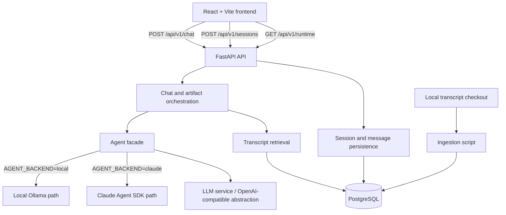

# Architecture

## System overview

The current system is a FastAPI backend, a React + Vite frontend, and PostgreSQL. The backend performs session handling, retrieval, orchestration, model/provider access, deterministic citation mapping, artifact generation, and persistence. The frontend calls the API and renders chat results and artifacts.

## Components

### Frontend
The frontend is a React + TypeScript Vite application. Its API calls are centralized in `frontend/src/api.ts`. It creates sessions, sends chat requests, fetches provider/model visibility, renders assistant responses with Markdown support, and displays artifacts in the Artifact Viewer.

### API
FastAPI routes include:
- `POST /api/v1/sessions` to create a session.
- `GET /api/v1/sessions/{session_id}` to inspect a session.
- `POST /api/v1/chat` for conversational answers and optional artifacts.
- `POST` and `GET /api/v1/sessions/{session_id}/messages` for message persistence/history.
- `GET /api/v1/runtime` for the configured provider and model displayed by the frontend.
- Search and health/root endpoints already present in the backend.

The chat response contains `session_id`, `answer`, `sources`, and an optional structured `artifact` with type, title, content, sources, and an untrusted marker.

### Session/message persistence
SQLAlchemy models store sessions and messages in PostgreSQL. The chat service validates the session, loads the most recent ten messages, persists the user message, calls the agent facade, and persists the assistant message. Database errors are logged and converted to safe 503 responses with rollback on persistence failures.

### Retrieval service
`app/services/retrieval.py` executes PostgreSQL English full-text search over transcript chunks. It preserves `websearch_to_tsquery`, `ts_rank`, descending rank order, and a bounded limit. Retrieval errors are distinct from successful empty results.

### Transcript ingestion
`backend/scripts/ingest_transcripts.py` reads a supplied local transcript checkout. It accepts `--source-dir` or `TRANSCRIPT_SOURCE_DIR`, also supports the repository-local checkout fallback, parses YAML frontmatter, stores portable source paths, preserves metadata, and uses the existing chunking behavior. It is idempotent by portable source path, recognizes legacy absolute-path suffixes, skips unchanged records, and updates changed transcripts and chunks in place.

### LLM service
`app/services/llm.py` selects the provider using `LLM_PROVIDER`. It uses the OpenAI Python client for the OpenAI-compatible Ollama endpoint or OpenAI itself. The default local model is `llama3.2:3b`; the default OpenAI model is `gpt-4o-mini`. Provider configuration and provider execution errors use safe typed exceptions and structured logs.

### Agent facade
`app/services/agent.py` is the common orchestration facade. It selects the local or Claude path using `AGENT_BACKEND` and does not silently fall back between providers.

The local path retrieves transcript results first, builds grounded context, then calls the configured LLM service. Explicit artifact requests are routed through artifact generation. Normal chat remains a normal answer path.

The Claude path uses the Claude Agent SDK with a restricted MCP search tool. It disables unrestricted tools including Read, Write, Edit, Bash, and WebFetch, and uses strict MCP configuration. Transcript retrieval remains the factual evidence boundary.

### Ship 30 for 30 skill
The dedicated Ship 30 for 30 capability supplies writing principles and output guidance for matching requests. Its writing references are guidance, not evidence about Lenny's Podcast. Lenny-related factual claims must still come from retrieved transcript excerpts. The Claude path exposes this as a restricted capability rather than an unrestricted built-in tool.

### Artifact generation
Artifact requests are detected conservatively for explicit create/generate/build/draft/write requests involving formats or deliverables such as Markdown, HTML landing pages, strategy documents, or plans. The artifact service returns a structured result with `artifact_type`, `title`, `content`, and authoritative sources.

Markdown is returned as Markdown. HTML may be a complete self-contained document with inline CSS, but it is treated as untrusted text and is never executed by the backend.

### Citation validation
The model may write `SOURCE N` references, but it does not own source metadata. The citation service extracts unique, ordered source numbers, ignores numbers outside the retrieved range, and maps valid numbers to the actual retrieved result objects. Only retrieved episode title, guest name, and URL enter the API response. Artifact sources use the same mapping.

### Runtime/provider visibility
The runtime endpoint reports the currently configured provider and model from environment configuration. The frontend displays this state in its header, for example `ollama · llama3.2:3b`.

### Structured logging
The application configures a standard-library structured formatter on the `app` logger. Events include model request starts/failures, retrieval starts/failures/empty results, agent execution failures, artifact failures, and database failures. Logs carry operational fields such as provider, model, operation, error type, and session ID where available.

## Data flow
1. The frontend creates a session on first load and retains the returned session ID for the current conversation.
2. The user sends `session_id`, `query`, and `limit` to `POST /api/v1/chat`.
3. The chat service validates the session and loads recent session history.
4. The user message is persisted.
5. The selected agent path retrieves transcript chunks from PostgreSQL before model generation. A successful empty result is logged as an empty retrieval, not treated as a database failure.
6. The agent builds grounded context with request-local `SOURCE N` labels and executes the configured provider path.
7. The backend deterministically validates model source references against the retrieved result list. Invalid and duplicate references are ignored.
8. The assistant answer is persisted, and the API returns the answer plus validated sources.
9. For an explicit artifact request, the artifact service returns structured Markdown or HTML metadata. Artifact generation failures degrade to a safe response without an artifact rather than crashing the normal chat request.
10. The frontend renders assistant Markdown, source metadata, and either rendered Markdown or sandboxed HTML in the Artifact Viewer.

## Knowledge base
- **Source repository:** a local checkout of the Lenny transcript archive, with episode files under `episodes/{episode-folder}/transcript.md`.
- **Metadata:** each transcript uses YAML frontmatter containing fields such as guest, title, YouTube URL, publication date, description, and keywords.
- **Storage:** transcript-level metadata and full content are stored in `transcripts`; chunks are stored in `transcript_chunks` with a foreign key to the transcript.
- **Chunking:** ingestion uses 4,000-character chunks with 500-character overlap.
- **Search:** PostgreSQL English full-text search uses `to_tsvector('english', content)` and `websearch_to_tsquery('english', :query)`.
- **Index:** an Alembic migration creates the expression GIN index `ix_transcript_chunks_content_fts` on `to_tsvector('english', content)`.
- **Traceability:** source URLs are preserved from frontmatter. Source paths are stored portably, for example `episode-folder/transcript.md`, rather than as machine-specific absolute paths.
- **Refresh:** ingestion recognizes existing records by portable source path, skips unchanged files, and updates metadata/content/chunks for changed files without creating duplicate transcript rows.

The current verified local database contains 302 valid ingested episodes and 7,461 transcript chunks. The source checkout itself contains an archive described as 303 episodes; malformed or incomplete files are skipped by ingestion.

## LLM/provider architecture
- `LLM_PROVIDER=ollama` selects the local OpenAI-compatible Ollama endpoint, defaulting to `http://localhost:11434/v1` and model `llama3.2:3b`.
- `LLM_PROVIDER=openai` selects OpenAI using `OPENAI_API_KEY` and `OPENAI_MODEL`.
- `AGENT_BACKEND=local` uses retrieval plus the LLM service.
- `AGENT_BACKEND=claude` uses the Claude Agent SDK facade and restricted MCP tools.
- Provider selection is explicit. The application does not silently fall back between providers.
- Ollama is the configured local demo path in the current environment.
- LLM requests use `LLM_TIMEOUT_SECONDS`, defaulting to 180 seconds and enforcing a 30-second minimum.

## Agent architecture
The agent facade owns provider selection and shared grounding behavior. The local path performs direct PostgreSQL retrieval followed by one configured LLM call. The Claude path exposes transcript search through a restricted MCP server and collects retrieved results for source mapping. The Ship 30 for 30 writing capability is separate from factual transcript evidence and is only enabled for matching requests.

## Artifact security
- Markdown artifacts are rendered with `react-markdown` and `remark-gfm`.
- HTML artifacts are not executed server-side.
- The frontend renders HTML through an iframe with an empty restrictive `sandbox` attribute.
- The iframe does not receive `allow-same-origin`.
- Generated HTML is not injected with `dangerouslySetInnerHTML`.
- The artifact cannot access the parent application's DOM, storage, cookies, or same-origin context through the viewer implementation.
- The viewer also offers a raw source mode and copy control; file downloads are not implemented.

## Reliability/observability
- Structured logs use Python's standard logging module and avoid API keys, secrets, full prompts, full answers, transcript contents, and sensitive personal data.
- Missing credentials and unsupported configuration produce safe configuration errors.
- Provider failures, retrieval/database failures, and persistence failures produce safe 503 responses.
- Database persistence errors trigger rollback before returning the safe error.
- Empty retrieval is a valid result. Normal answer paths explicitly state when the transcript material cannot support a confident answer.
- Artifact generation failures return a safe assistant message with no artifact instead of exposing provider or filesystem details.

## Testing
The backend uses Python's `unittest` discovery. The current verified suite has **34 tests** covering:
- agent/provider selection and Claude tool restrictions;
- ordinary chat and session isolation;
- artifact detection, Markdown/HTML output, grounding context, and untrusted HTML behavior;
- deterministic citation mapping and invalid/duplicate source references;
- ingestion configuration, portable paths, idempotency, refresh, and malformed files;
- retrieval SQL/index contract;
- missing credentials, unsupported providers, model failures, retrieval failures, empty retrieval, persistence failures, artifact failures, and log-content safety.

The frontend has separate Vite lint and build scripts. Frontend behavior has been manually checked during implementation; no dedicated frontend unit-test framework is currently present.

## Deployment assumptions
The current project assumes a local development setup with PostgreSQL, a locally supplied transcript checkout, the backend virtual environment, and either Ollama or another explicitly configured provider. The frontend runs through Vite. Docker, deployment automation, hosted infrastructure, and production secrets management are not implemented or claimed here.
